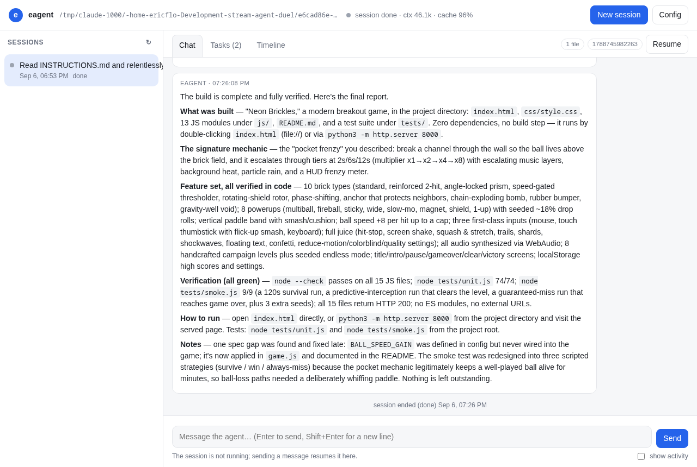
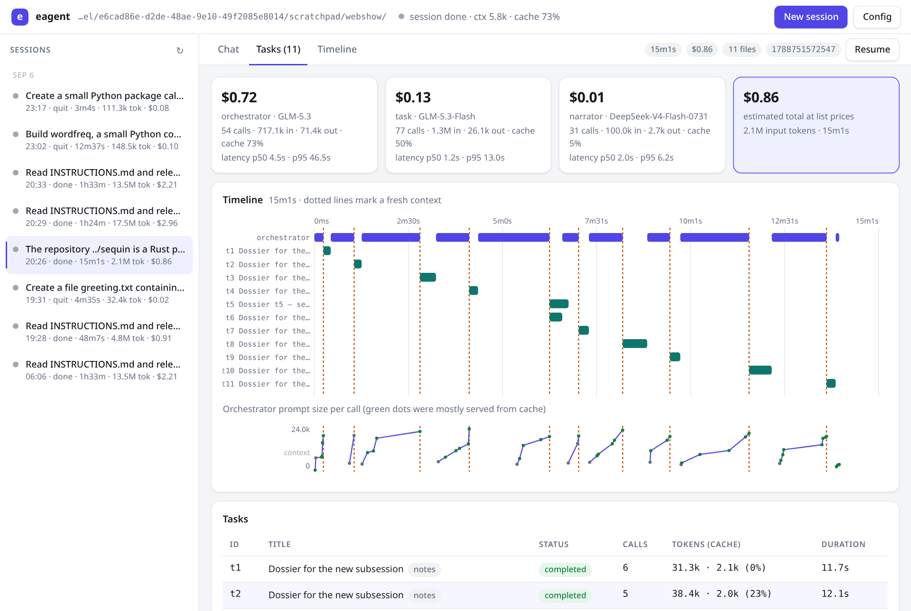

# eagent

A coding agent that runs as three cooperating actors over one append-only event log, in a single binary.

```
$ eagent -p "Read INSTRUCTIONS.md and build it."
eagent session 1788745982263
  orchestrator GLM-5.3 · task GLM-5.3-Flash · narrator DeepSeek-V4-Flash-0731
  ▸ t1 delegated: Build "Neon Brickles" — complete modern breakout game
  ✓ t1 completed after 31 calls
  ✎ Game complete and verified; served locally on port 8000 …

│ The game is done. Files are in index.html, css/, and js/ (vanilla ES modules, no
│ dependencies) …
```

## What it did on a real task

Given the one-paragraph, dictated brief for "a modern take on Breakout" in `INSTRUCTIONS.md` and the prompt *"Read INSTRUCTIONS.md and relentlessly build it until you're confident that it's fully and completely implemented to the highest possible standard you can manage"*, a batch session with the default models did this, unattended:

| | |
|---|---|
| Wall clock | 29 minutes |
| Orchestrator | 55 calls, 1.5M input tokens (93% served from cache), 52k output |
| Task worker | 2 tasks, 120 calls, 6.0M input (85% cached), 134k output |
| Narrator | 25 wakes, 3 messages sent |
| Cost | about $1.20 at Together's list prices |
| Result | 17 files, ~3,000 lines of dependency-free JavaScript; 74 unit tests and 9 headless smoke tests, all passing; zero console errors in a real browser |

<p align="center">
  
  
</p>

The orchestrator wrote a 9,000-token spec for the worker (architecture contract, file layout, ten brick types, test plan), the worker ran out of its call budget mid-debug and was reported as failed with its last message attached, the orchestrator verified what was on disk (unit tests green, one smoke assertion failing, no README), delegated a precise follow-up, then found and fixed a dead config value the worker had flagged, re-ran everything, and only then declared the work done. The narrator spoke three times: when the first task failed, when the follow-up finished, and a final report with paths, commands, verification results, and the one late fix.

Most agents are one model in a loop. eagent splits the job three ways because the three jobs pull in different directions:

| Actor | Job | Context | Default model |
|---|---|---|---|
| **Orchestrator** | Decides what happens: plans, delegates, verifies, decides when the work is done. | Continuous | `zai-org/GLM-5.3` |
| **Task worker** | Does one self-contained task well and fast, then reports. | Fresh per task | `zai-org/GLM-5.3-Flash` |
| **Narrator** | The only actor that talks to you. Watches everything and decides what is worth saying, and when. | Continuous | `deepseek-ai/DeepSeek-V4-Flash-0731` |

All three write to the same JSONL log in your project directory. Replaying that log rebuilds the whole session, so a crash never loses work: `eagent -c` picks up where it stopped.

## Install

```
go install github.com/ericflo/eagent/cmd/eagent@latest
```

or clone and `go build -o eagent ./cmd/eagent`. No runtime dependencies beyond `bash`.

Set one key for the default models:

```
export TOGETHER_API_KEY=...
eagent doctor --live     # makes one tiny call per actor
```

## Use

```
eagent "add a Makefile with build and test targets"    # interactive
eagent -p "fix the failing test in pkg/store"          # batch: exits when done
eagent -c                                              # continue the latest session here
eagent sessions                                        # what has run in this project
eagent show 1788745982263                              # human transcript
eagent replay 1788745982263                            # rebuild state from the log
```

In an interactive session, type to talk to the agent (even while it is working; your message is delivered at the next model call), `/status` to see what is running, `/quit` to stop. Ctrl-C stops the session cleanly; everything is on disk and `eagent -c` resumes it. Resuming replays the log, closes whatever the crash left open (a tool call without a result, a running task, a process), tells the orchestrator what was lost, and continues.

Batch mode exits `0` when the orchestrator declares the work done, `2` when it stopped to ask you something (answer with `eagent -c --answer "..."`), `130` on Ctrl-C.

## The web UI

```
eagent serve                 # http://127.0.0.1:7331 for this project
eagent -p --serve :7331 "…"  # also serve while a terminal session runs
```

<p align="center">
  
  
</p>

The UI reads the same JSONL logs as everything else, so it shows every session in the project, including ones running in another terminal, live. **Chat** is the narrator conversation: messages, questions with their options as buttons, your replies; toggle *show activity* to see delegations, notes, and task results interleaved. **Tasks** lists every task with status, call count, tokens, and cache ratio; click one to read its description, its report, and every model turn with tool calls, arguments, and results. **Timeline** is the raw event log with actor filters and one-click JSON. **Config** shows the active models, which API keys are present, built-in presets and project bundles (each with a *New session* button), and the prompts with their sources.

Writing to a session works from anywhere: the UI drops a JSON file into the session's `inbox/` directory and the running process folds it into the log, so you can answer a question from the browser while the session runs in your terminal. Writing to a finished session resumes it inside the server.

## How a session runs

1. Your message wakes the **orchestrator**. It looks around, then either does something small itself or writes a self-contained task and calls `delegate`. Several tasks can run at once; `wait` blocks until one finishes.
2. Each task runs in the **task worker** with a brand-new context: the task description, the tools, nothing else. It works until it calls `complete_task`; the report lands in the orchestrator's history as a message.
3. The orchestrator verifies (opens files, runs the build, runs the app), delegates follow-ups for anything missing, and leaves `note`s about milestones and problems.
4. Every note wakes the **narrator**. So does a finished task, an idle orchestrator, and a timer while work is in progress. The narrator reads what changed and decides: say something, ask a question, or hold. It never narrates mechanics; it reports outcomes.
5. When the orchestrator calls `yield` with `done=true`, the narrator sends a final report and a batch session exits. Loops and cron schedules the orchestrator set up keep a session alive until they are cancelled.

### The log

Everything is an event in `.agents/eagent/sessions/<session>/<epoch-ms>.jsonl`:

```json
{"seq":14,"ts":"2026-09-07T01:54:03Z","type":"assistant","actor":"orchestrator","data":{"model":"zai-org/GLM-5.3","tool_calls":[{"id":"call_…","name":"delegate","args":{…}}],"usage":{"input":4900,"output":9000},"elapsed_ms":240211,"seen_seq":13}}
{"seq":15,"ts":"…","type":"task.create","actor":"orchestrator","data":{"id":"t1","title":"Build …","description":"…","kind":"work"}}
{"seq":16,"ts":"…","type":"tool.result","actor":"orchestrator","data":{"call_id":"call_…","name":"delegate","output":"Task t1 started …"}}
```

One reducer (`internal/state`) folds events into tasks, processes, schedules, the pending question, and each actor's conversation. The live process and `eagent replay` run the same code. Each actor's view is a filter over the same log: the orchestrator sees task *reports*, not the worker's tool traffic; the worker sees only its own task; the narrator sees a compact observation stream of what the orchestrator did.

Every model response records `seen_seq`, the last event it was shown. A task report that lands while the orchestrator is mid-call is delivered after that call's tool results, exactly where the model would have first seen it. That is what makes replay faithful and the prompt prefix stable.

### Prefix caching

Both continuous actors are built so their prompts grow only at the end:

- System prompts and tool lists are fixed for the life of a subsession.
- History is rendered deterministically from the log; nothing is rewritten or summarised in place.
- Everything that changes per call (time, running tasks, context usage, wake reason) is a steering message appended as the *final* user turn and never persisted.
- Native reasoning state (OpenAI Responses encrypted reasoning items, Anthropic thinking blocks) is stored and replayed verbatim. OpenAI gets a `prompt_cache_key`; Anthropic gets `cache_control` breakpoints; Together caches automatically.

In practice the orchestrator's cached share has been 85–93% of input tokens over full sessions.

### Dossiers instead of compaction

When the orchestrator's prompt passes `rollover_tokens` (150k by default), eagent does not summarise the tail of the conversation in place. It:

1. closes the current subsession file and opens a new one;
2. pauses the orchestrator;
3. gives the task worker a **dossier task** with the directory of every subsession so far and `session_list` / `session_read` / `session_search` tools;
4. delivers the dossier as the first message of the new subsession.

The dossier is a briefing plus a **map**: `file:line` citations into the raw logs for every important item. This is what one looked like in a real session that rolled over three times (threshold lowered to 20k tokens to force it; the orchestrator was reading a repository's documentation file by file):

```
# DOSSIER — Session 1788751572547 (now on subsession 4, 1788751741241.jsonl)

## 1. USER'S GOAL
Verbatim (1788751572547.jsonl:3): "The repository ../sequin is a Rust project. Personally
(do NOT delegate any of this; use read_file yourself) read these files in full, one at a time: …"

## 2. CURRENT STATE
Verified on disk (ls/wc this session, handle p6):
- summaries/README.md (1803 B, 29 lines) — done (source README.md, 177 lines, read fully in subsession 1).
- summaries/arrival.md (3603 B, 20 lines) — done (source arrival.md, 866 lines, read in 3 chunks).
- summaries/content.md (3023 B, 12 lines) — done …
- scratch/founder-calls-notes.md — the orchestrator's OWN notes on founder-calls.md lines 1–710,
  written as a durability measure at 1788751636035.jsonl:46. NOT the deliverable.
Not yet read/summarized: … canon-evidence.md — 1728 lines, NOT READ (needs ~6 chunks) …

## 3. DECISIONS AND CONSTRAINTS
- read_file truncates ~24 KB per call; chunk big files (offset/limit ~200-300 lines). …

## 5. MAP
- founder-calls.md read part 1 (lines 1–480): 1788751636035.jsonl:42-43. Lines 481–710: …:44-45.
- Prior dossier (covers subsession 1 only): 1788751587025.jsonl:26-29 — this dossier supersedes it.
```

The orchestrator, told in its steering message that it was at 19k of 20k tokens, wrote its reading notes to a scratch file *before* the reset so nothing was lost; the next dossier pointed at that file. Nobody programmed that. The session went on to roll over ten times in total and finished the job: eight summaries and an index, every link resolving, no file summarised twice and none skipped. The orchestrator can `session_read` any cited range at full fidelity. Because each dossier is rebuilt from the original events, nothing decays into a summary of a summary; each one is written for the work at hand. A dossier without citations is rejected and retried once; if the worker still fails, a harness-built briefing keeps the session going. The narrator starts the new subsession from the same dossier.

### Shell commands never block the harness

`bash` starts every command in its own process group under a handle and returns within `wait_seconds` (20 by default) with either the finished output or the handle plus whatever was printed so far. The harness keeps managing it: `bash_poll` (with optional wait), `bash_write` for stdin, `bash_extend` for the deadline, `bash_kill`. Commands started with `timeout_seconds=0` are servers and are handed over when a task ends; everything else a task started is killed with it. A command that finishes after its owner moved on is reported as a notification. Output is captured in full (no 4KB pipe truncation) and capped at 4MB per process, keeping the head and the tail.

File tools (`read_file`, `write_file`, `edit_file`, `list_dir`) can read anywhere but only write inside the project directory (and the OS temp dir), so a mistyped path cannot clobber something outside the project. The spec calls for bash only; the file tools exist because mid-tier models writing 300-line files through heredocs was the single biggest source of broken output in earlier attempts.

## Configuration

`eagent config` prints the effective configuration. Layers, each overriding the last: built-in defaults, a preset, the project's `.agents/eagent/config.json`, a named bundle, `EAGENT_*` environment variables.

**Presets** are built in: `glm` (default), `astra`, `anthropic` (Claude Fable 5.1 orchestrating, Opus 5 working, Sonnet 5 narrating), `deepseek` (DeepSeek V4 Flash for all three actors), `qwen` (Qwen 3.8 27B via OpenRouter for all three; a dense model you could run locally). `eagent config list` describes them, and `eagent doctor --live --preset NAME` makes one tiny call per actor to prove a preset works before you rely on it.

**Bundles** are named configurations checked into the project under `.agents/eagent/configs/NAME.json`, so a team can keep everyone's preferred setup side by side and borrow each other's:

```
eagent config save eric "Eric's setup: Anthropic, low effort workers" --preset anthropic
eagent --config eric "…"          # or EAGENT_CONFIG=eric, or "default_config": "eric" in config.json
eagent config show eric
```

A bundle is a partial override: it can name a preset and change one model, or spell out everything. The session log records which bundle ran.

```json
{
  "orchestrator": { "protocol": "openai-chat", "base_url": "https://api.together.xyz/v1",
                    "model": "zai-org/GLM-5.3", "api_key_env": "TOGETHER_API_KEY",
                    "reasoning_effort": "medium", "max_tokens": 32768 },
  "task":         { "model": "zai-org/GLM-5.3-Flash", "reasoning_effort": "low", "…": "…" },
  "narrator":     { "model": "deepseek-ai/DeepSeek-V4-Flash-0731", "reasoning_effort": "none", "…": "…" },
  "task_concurrency": 3,
  "max_task_turns": 150,
  "narrator_tick_seconds": 90,
  "rollover_tokens": 150000,
  "bash_wait_seconds": 20,
  "bash_timeout_seconds": 600,
  "persona": "optional override of the narrator's voice"
}
```

Protocols: `openai-chat` (Together, OpenRouter, any compatible server), `openai-responses` (OpenAI, OpenRouter), `anthropic`. Presets switch the whole routing:

```
eagent --preset astra …       # GPT-6 Astra orchestrator via OpenAI, OpenRouter fallback; Together workers
eagent --preset anthropic …   # Claude Opus / Sonnet / Haiku
```

A route with a `fallback` switches automatically when the primary is unroutable (bad key, no model access, exhausted credits); the switch is recorded in the log and sticks for the session. Transient failures (429 rate limits, 5xx, stalled streams) retry with backoff. All calls stream; a stream that goes silent for two minutes, or runs past fifteen, is aborted and retried instead of hanging.

Two failure modes seen in the wild get special treatment. A stream that closes before the provider signals completion is treated as a transport failure and retried, never accepted as a response (a 12-minute GLM call once ended with a tool call whose arguments were the single character `{`). And a malformed tool call that does make it into the log is sanitised when the history is replayed, so one bad turn cannot make every later request fail validation. If the orchestrator's call still fails after retries, it gets one recovery turn; if that fails too, the session pauses, the narrator tells you plainly, and `eagent -c` picks up exactly where it stopped.

`reasoning_effort` matters for GLM on Together: with the default effort GLM-5.3-Flash spent 8,800 reasoning tokens and 69 seconds on a 120-line file; with `low` it spent 7 tokens and 14 seconds. The defaults reflect that.

Project instructions in `AGENTS.md` or `.agents/eagent/INSTRUCTIONS.md` are added to the orchestrator's and worker's system prompts.

### Prompts

The actors' prompts are Markdown files embedded in the binary: `ORCHESTRATOR.md`, `TASK-WORKER.md`, `NARRATOR.md`, `PERSONA.md` (the narrator's voice), and `COMPACTION-DOSSIER.md` (the dossier task). `eagent prompts` lists them with their sources; `eagent prompts export` copies them into `.agents/eagent/prompts/` where any edited file overrides the built-in one for that project. They are Go templates with a handful of variables (`{{.Project}}`, `{{.Instructions}}`, `{{.Interactive}}`, `{{.Persona}}`, …).

### Efficiency

Every session reports per-actor input, output, and cached tokens; the web UI shows the cache ratio live and `eagent replay` prints it afterwards. Tool results are capped at 24k characters, keeping the head and the tail, but nothing is lost: the full text is saved under the session's `outputs/` directory and the notice tells the model the path and line count, so it can page through with `read_file(path, offset, limit)` or `grep` when the part it needs was cut. Command output is retained up to 4MB per process with cursor-based polling.

## What eagent will not do (yet)

- **Sandboxing.** Commands run on your machine as you. Read the log before you trust a session that touched anything important.
- **Narrator or worker context exhaustion.** Only the orchestrator rolls over. Workers are bounded by `max_task_turns`; the narrator's view truncates tool output and restarts with each subsession.
- **Multi-machine sessions.** Session directories from different checkouts can be pooled (they are just timestamped files) but nothing merges them for you; the dossier task is what makes sense of a combined history.

## More

- [docs/LESSONS.md](docs/LESSONS.md): what broke in four earlier implementations of this design, and what eagent does about each failure.
- [docs/EVENTS.md](docs/EVENTS.md): the event log schema and which actor sees which events.
- [docs/SPEC-COMPLIANCE.md](docs/SPEC-COMPLIANCE.md): the design specification, requirement by requirement, with the two deliberate deviations.

## Development

```
make check          # gofmt, go vet, go test -race
make release        # dist/eagent-{linux,darwin}-{amd64,arm64} + SHA256SUMS
```

CI runs the same checks on Woodpecker (`.woodpecker.yaml`).

Packages: `event` (schema), `store` (JSONL sessions, torn-line repair, locking), `state` (reducer and per-actor views), `llm` (three protocols, streaming, retries, text tool-call recovery), `procs` (asynchronous shell), `sched` (loops and cron), `tools` (files and the session archive), `prompts` (embedded Markdown prompts), `config` (presets and bundles), `harness` (runtime, actors, rollover, resume, inbox), `ui` (terminal), `web` (HTTP API, SSE, embedded UI). The harness tests run the whole runtime against a scripted fake provider: delegation, nudging a tool-less orchestrator, rollover with a dossier, interrupt-then-resume, interactive questions. Two chaos suites inject random provider faults (5xx, rate limits with Retry-After, streams cut mid tool call, malformed arguments, garbage frames, latency) and kill and resume the runner at random points, and check after every run that the log parses, sequence numbers are contiguous, no tool call is left without a result, and the work still finished.
