# The Breakout grid: six presets, one brief

On 2026-09-07 six eagent presets each built the same game from the same one-paragraph spec, in parallel, unattended. A seventh eagent session then measured all six: it parsed their event logs, served each build, played it with scripted Chromium, took screenshots, and scored it against a nine-item rubric. This page is the record: what ran, what it cost, what each build shipped, and what the exercise changed in the harness.

## What was run

The spec is [`docs/grid/SPEC.md`](grid/SPEC.md). In one paragraph: a modern take on Breakout built around the moment the ball gets above the bricks and keeps going on its own, with things escalating once it is up there. Game juice that scales with score and multiplier. Power-up balls, and bricks that are difficult in ways other than hit counts, such as a required angle or a required speed. A paddle that also moves up and down, where moving up on contact accelerates the ball. Mouse play, with mobile thumb or thumbstick control as a first-class citizen. Polish and audio.

Every build got the same prompt:

> Read INSTRUCTIONS.md and relentlessly build it until you're confident that it's fully and completely implemented to the highest possible standard you can manage.

The six presets, with the model each actor ran:

| Preset | Orchestrator | Task worker | Narrator |
|---|---|---|---|
| `glm` | GLM-5.3 | GLM-5.3-Flash | DeepSeek V4 Flash (Together AI) |
| `openrouter-high` | Kimi K3 | GLM-5.3 | GLM-5.3-Flash (OpenRouter) |
| `anthropic-high` | Claude Fable 5.1 | Claude Opus 5 | Claude Sonnet 5 |
| `anthropic-med` | Claude Opus 5 | Claude Sonnet 5 | Claude Haiku 4.5 |
| `openai-high` | GPT-6 Astra (high effort) | GPT-5.6 Sol | GPT-5.6 Luna |
| `openai-low` | GPT-5.6 Sol | GPT-5.6 Luna | GPT-5.6 Luna |

Each run started in its own directory holding nothing but `INSTRUCTIONS.md`, with the phone mirror off (`EAGENT_FINALECHAT=off`). All six ended by declaring the work done. None rolled its context over, and no narrator asked a question.

The measuring run was itself an eagent session on the `openrouter-high` preset, following a written brief. It parsed each run's JSONL event logs for duration, tokens, cache hits, tasks, narrator messages and errors; computed cost at September 2026 list prices; served each build statically and played it with scripted Chromium (Playwright) at a 1280×800 desktop viewport and a 390×844 touch phone viewport; captured console and page errors; and scored the nine spec items from code reading plus that play. It took 16 minutes. Its brief and the raw per-build reports live with the run directories outside this repository; [`docs/grid/results.json`](grid/results.json) is the compiled data.

## Results

All numbers are from `results.json`. Models are listed as orchestrator / task worker / narrator.

| Preset | Models | Duration | Cost | Tokens in | Tokens out | Cache | Tasks | Rollovers | Narrator messages | Errors | Lines of code | Tests | Console errors in play |
|---|---|---|---|---|---|---|---|---|---|---|---|---|---|
| `glm` | GLM-5.3 / GLM-5.3-Flash / DeepSeek V4 Flash | 38 min | $2.19 | 4.3M | 163k | 78% | 6/6 | 0 | 3 | 0 | 3,335 | yes, pass | 0 |
| `openrouter-high` | Kimi K3 / GLM-5.3 / GLM-5.3-Flash | 19 min | $1.23 | 1.9M | 83k | 88% | 1/2 | 0 | 2 | 1 | 1,071 | none | 0 |
| `anthropic-high` | Fable 5.1 / Opus 5 / Sonnet 5 | 1 h 11 min | $15.54 | 12.0M | 175k | 93% | 3/3 | 0 | 3 | 0 | 3,195 | yes, pass | 0 |
| `anthropic-med` | Opus 5 / Sonnet 5 / Haiku 4.5 | 3 h 6 min | $24.80 | 54.1M | 539k | 95% | 15/15 | 0 | 19 | 0 | 5,896 | none | 0 |
| `openai-high` | GPT-6 Astra / GPT-5.6 Sol / GPT-5.6 Luna | 24 min | $31.59 | 6.9M | 114k | 6% | 9/9 | 0 | 17 | 0 | 1,504 | yes, pass | 0 |
| `openai-low` | GPT-5.6 Sol / GPT-5.6 Luna / GPT-5.6 Luna | 5 min | $0.71 | 813k | 24k | 15% | 4/4 | 0 | 6 | 0 | 34 | none | 0 |

Model calls, as orchestrator / task worker / narrator: `glm` 130 (68/36/26), `openrouter-high` 101 (31/57/13), `anthropic-high` 177 (30/131/16), `anthropic-med` 836 (61/733/42), `openai-high` 273 (60/183/30), `openai-low` 76 (23/44/9).

Notes on the table:

- Every build loaded and played with zero console errors and zero page errors under automation, desktop and phone.
- The one error is `openrouter-high`'s first task, which died on an API 404 from OpenRouter ("No endpoints found that support image input"); the second task completed the game anyway. See commit `4b8e277` below.
- Tests: `glm` shipped a playwright-core headless harness (`node test/full.js`, all checks passing, reporting about 61 FPS); `anthropic-high` shipped browser tests (`node test/verify.mjs`, `node test/tiers.mjs`, both passing); `openai-high` shipped 9 unit tests, all passing, plus a Playwright e2e suite it did not run. `anthropic-med`, `openrouter-high` and `openai-low` shipped no test suite.
- `openai-low`'s line count is not comparable: its source is minified, about 34 physical lines and 10 KB of `game.js`.

## Rubric

Each spec item scored 0 to 3: 3 means present, working and genuinely well done; 2 present and working; 1 token effort; 0 absent.

| Spec item | `glm` | `openrouter-high` | `anthropic-high` | `anthropic-med` | `openai-high` | `openai-low` |
|---|---|---|---|---|---|---|
| Breakthrough | 3 | 3 | 3 | 3 | 3 | 2 |
| Juice | 3 | 3 | 3 | 3 | 3 | 2 |
| Power-up balls | 3 | 3 | 3 | 3 | 3 | 2 |
| Special bricks | 3 | 3 | 3 | 3 | 3 | 2 |
| 2-D paddle | 3 | 3 | 3 | 3 | 3 | 2 |
| Mouse | 3 | 3 | 3 | 3 | 3 | 2 |
| Mobile | 2 | 2 | 3 | 3 | 3 | 3 |
| Polish | 3 | 3 | 3 | 3 | 3 | 2 |
| Audio | 3 | 3 | 3 | 3 | 2 | 1 |
| **Total (of 27)** | **26** | **26** | **27** | **27** | **26** | **18** |

The evidence behind each score, per build, quoted from the measuring run's reports:

### glm — Neon Breakout Breach Edition (26/27)

- **Breakthrough:** `js/game.js:248-306` full breach system — ball above bricks triggers a 'BREACH!' banner, breachBounces raise breachTier to x64 (`CFG.BREACH_TIER_MAX:6`), `totalMult()=comboMult()*breachMult()`; `levels.js` designs each level with a 'breach path' into the attic.
- **Juice:** `js/game.js:188-193` 'const tierBoost = 1 + G.breachTier * 0.22; FX.burst(...10 + G.breachTier*2...*tierBoost); FX.flash; FX.shake(3 + G.breachTier * 1.2)' — particles/flash/shake all scale with breach tier; audio pitch scales with combo (`audio.js:465` 'var pitch = 1 + Math.min(c,24)/18; // brighter with combo').
- **Power-up balls:** `js/game.js:334-361` + `config.js` POWERUPS: piercer ('Ball pierces bricks'), inferno ('Burning ball, chains powder', fire splash at `game.js:715`), split/triple (`splitBalls()` `game.js:361`) — three distinct ball power-ups, weighted drop pool.
- **Special bricks:** `config.js` `FAST_GATE:640` ('fast' needs ball speed; `game.js:750` 'if (br.t==="fast" && speed < CFG.FAST_GATE) // rejected: too slow'), ward bricks gated by approach-direction cone (WARD_CONE, 'SHIELD' reflect), anchor (indestructible), powder (chain-explodes) — four non-hit-count mechanics.
- **2-D paddle:** `config.js` `BAND_TOP:900`/`BAND_H:190` paddle vertical band; `game.js:654-673` 'slamActive = paddle.slamT>0 || paddle.vy < CFG.SLAM_VY ... newSpeed = sp*CFG.SLAM_BOOST(1.45); else if (paddle.vy < -140) sp*1.12; b.vy += paddle.vy*0.16' — up-motion thrust plus slam mechanic.
- **Mouse:** `js/game.js:395` 'window.addEventListener("mousemove", ... input.mouseX/Y, mouseActive)' with input priority 'touch > mouse > keys > gamepad' (`game.js:496`).
- **Mobile:** `game.js:423-453` touchstart/touchmove with preventDefault, multi-touch identifier tracking, fast-upward-swipe slam; DOM SLAM button shown only on touch devices (`isTouchDevice()`, touchUI) — first-class touch but drag-anywhere rather than a literal thumbstick.
- **Polish:** Pause screen/visibilitychange auto-pause (`game.js:1591`), DOM menu/help/over/pause screens, canvas HUD, gamepad support; loop is rAF with capped dt (`Math.min(dt,1/20)`) plus ball sub-stepping rather than fixed timestep; no TODO/FIXME found; dead code minimal.
- **Audio:** `audio.js` is a 712-line fully synthesized engine: setBreach(level) 'drives music layers, drone, arp rate', setMultiplier 'opens master filter, raises arp rate', setCombo raises impact pitch, breachEnter/Exit sweeps, 25ms lookahead music scheduler — intensity explicitly scales with breach/multiplier.

### openrouter-high — Neon Breakout Frenzy Edition (26/27)

- **Breakthrough:** `index.html` boardStep: 'frenzy: any ball above topmost alive brick row ... frenzy=Math.min(1, frenzy + dt*0.24)' with FRENZY_CAP tiers x2^lvl up to x32, score ticks 'gain=Math.pow(2,frenzyLvl)*5', HUD prompt 'GET THE BALL ABOVE THE BRICKS → FRENZY', levels 'deliberately include gaps/channels'.
- **Juice:** 'spark(br.x+br.w/2,..., 10+frenzyLvl*4, hue, 240+frenzyLvl*40); shakeIt(1.2 + frenzyLvl*0.6)' in destroyBrick; arpTick 'tempo = 0.42 - frenzyLvl*0.05' and pitch 'root = 220 * Math.pow(1.12, frenzyLvl)' — particle count, shake, and music tempo/pitch all scale with frenzy/combo.
- **Power-up balls:** P_KINDS: MULTI (adds 2 balls), LASER (laserTimer, pierce: 'const pierce = laserTimer>0 || b.fire'), FIRE (fireball pierce with neighbor splash in destroyBrick) — three working ball power-ups plus WIDE/SLOW paddle effects.
- **Special bricks:** T_ANGLE requires near-vertical approach ('brickAngleOK: Math.abs(b.vx) < Math.abs(b.vy)*0.62' else 'ANGLE LOCKED' repel), T_SPEED 'sp > 480 + level*12' else 'TOO SLOW' repel; only CORE uses multiple hits and is rare/late-level — angle and speed mechanics dominate.
- **2-D paddle:** PADDLE_MIN_Y/MAX_Y (about 120px band); 'paddle.y += (ty-paddle.y)*...' follows pointerY; collidePaddle 'THRUST: if(paddle.vy < -60){ sp=clamp(sp*1.22+paddle.vy*-0.06,...); thrustFlash=1; ...THRUST!' — upward paddle motion accelerates ball.
- **Mouse:** 'canvas.addEventListener("mousemove", e=>{ const p=toBoard(e); pointerX=p.x; pointerY=p.y; })' drives both paddle axes; mousedown launches / routes on-screen buttons.
- **Mobile:** touchstart/touchmove/touchend with preventDefault {passive:false}, touch-action:none CSS, touch-friendly 52x32 pause/mute buttons and large overlay buttons — solid direct-touch control but no thumbstick widget.
- **Polish:** Fixed timestep: 'const STEP=1/120 ... while(acc>=STEP){ acc-=STEP; update(STEP,...) }' with delta cap; pause scene + visibilitychange auto-pause, mute with localStorage persistence, HUD with frenzy meter/effect timers, help screen, endless mode, high score; hitButton/drawButton system; no TODO/FIXME.
- **Audio:** AudioContext with distinct SFX per brick type (sBreak branches: sawtooth sweep for angle, noise+sub thud for speed), noise-buffer hits, and an arp music loop whose tempo, pitch, and waveform escalate with frenzy level (arpTick).

### anthropic-high — TOPSIDE (27/27)

- **Breakthrough:** `game.js` updateOnTop(): hysteretic column-aware on-top detection ('A ball starts riding when it is above the top of the highest intact brick in its own column band'), multiplier ramps to 60 while riding, 4 escalation tiers with callouts ('ON TOP!', 'TOPSIDE GOD') and topBonus() escalation rewards.
- **Juice:** breakBrick(): 'this.fx.burst(brick.cx, brick.cy, color, (this.onTop ? 14 : 9) + tier * 6, 220 + tier * 45 ...)' plus shake '(this.onTop ? 3.5 : 2) + tier * 0.7', fx.js tier palettes, chromatic aberration, hitstop, and adaptive fps-driven particle budget.
- **Power-up balls:** `balls.js` POWERUPS: MULTIBALL, FIRE ('FIREBALL', fireTime=8, passes through bricks), HEAVY, GHOST, ROCKET ball powers applied via Ball.applyPower(), plus paddle powers (WIDE/STICKY/MAGNET) — ball power-ups are the majority and fully wired into physics.
- **Special bricks:** brickResponse(): PRISM needs a steep angle ('STEEP!'), STEEL needs speed >= STEEL_SPEED ('FASTER!'), ANVIL must be hit 'from above', plus PORTAL_A/B teleport bricks, indestructible WALL, pass-through GLASS, BOOM chain explosions — all non-multi-hit mechanics.
- **2-D paddle:** `paddle.js` BAND_TOP/BAND_BOTTOM vertical band; `physics.js` paddleBounce(): 'const up = -p.vy; let newSpeed = speed + up * 0.30' with smash when up > 620 ('SMASH!' + hitstop + fx.addShake(11)).
- **Mouse:** `game.js` updatePaddleControl(): 'mouse: absolute follow — p.moveTo(inp.absolute.x, Math.max(BAND_TOP, Math.min(BAND_BOTTOM, inp.absolute.y)) ...)', input.js sets this.absolute on pointermove for non-touch.
- **Mobile:** input.js: 'Virtual thumbstick anchored where the thumb landed' (this.stick = { baseX, baseY, ... }), relative-drag delta for paddle, tap-to-launch, document touchmove/touchstart preventDefault, pointer capture, releaseAll on blur/visibilitychange.
- **Polish:** `main.js` fixed timestep 'STEP = 1/120' accumulator loop with fps watchdog + adaptive render scale; pause on visibilitychange/blur; high-score persistence; test/soak.mjs autoplay harness; no TODO/FIXME/dead code found in src/.
- **Audio:** `audio.js` full Web Audio graph (compressor, convolution reverb, drone): 'update(dt, {multiplier, onTop, playing})' ramps musicBus/drone/filter with intensity, and while on-top runs a tier-layered arpeggio with 'bpm = 110 + tier * 40 + this.intensity * 90'.

### anthropic-med — ROOFTOP (27/27)

- **Breakthrough:** `game.js` _updateRooftopState(): ball above bricks.topY => 'ROOFTOP!' banner, flash/shake/shockwave/slowmo, 'this._multTimer >= 1.6 -> _bumpMultiplier()' stepping through MULT_STEPS [1,2,4,8,16,32] with debounce grace.
- **Juice:** ParticleSystem(2200) with trails/shockwaves/confetti, Juice (shake/flash/slowmo/tint), onBrickDestroyed(): 'HIGH-MULTIPLIER ESCALATION: at 8x+ every break gets extra particle emission', background.update driven by intensity + (multiplier-8)/24 escalation, rooftopAura particles while riding.
- **Power-up balls:** `powerups.js` POWERUP_TYPES includes 'multi' (spawns 2 balls), 'fire' and 'heavy' set b.mode on all balls (entities.js BALL_MODE_COLORS fire/heavy/ghost with fire flicker glow), 'nova' arms the ball (_triggerNova 220px blast on next paddle hit); 'laser' fires paddle bolts.
- **Special bricks:** `bricks.js` canBreak(): 'angle' requires incoming direction within 35deg of stored angle, 'speed' needs speed >= threshold, 'slow' needs speed <= threshold, 'phase' bricks turn intangible on a sine cycle ('time your shot'), 'mirror' never breaks and deflects 90deg — all non-multi-hit.
- **2-D paddle:** `entities.js` Paddle.update clamps ty to 'yMin = H - 320 + h/2 ... yMax = H - 90'; _reflectPaddle(): 'if (pvy < 0) { const boost = 1 + Math.min(0.35, |pvy|/2600); speed *= boost' with smash sfx/particles when |pvy|>700.
- **Mouse:** `core/input.js` window mousemove/mousedown handlers set 'this.target.x = p.x; this.target.y = p.y' via toLogical view transform; note: target only updates while _mouseActive (after first mousedown).
- **Mobile:** `core/input.js` touchstart/touchmove/touchend handlers with first touch becoming the stick ('_stickTouchId'), second finger = tap action, deadzone + 130px radius, drawn thumbstick (drawThumbstick with pulsing ring), stick re-promotion on touch end.
- **Polish:** `main.js` 'FIXED_STEP = 1/120' accumulator with MAX_SUBSTEPS and slowmo timeScale; `game.js` full state machine (title/ready/playing/paused/dead/gameover/levelclear), restart(), results screen, tutorial hints, anti-stall PRESSURE system, no TODO/FIXME found.
- **Audio:** `core/audio.js` (712 lines) procedural engine: setIntensity() ramps filter cutoff '400 + intensity*(6000-400)' and '_bpm = 110 + intensity*40'; setRooftop(true) opens a shimmer high-arp layer and 7kHz cutoff; extensive sfx set (brick, clang, mirror, laser, explosion, rooftop, riser).

### openai-high — APOGEE (26/27)

- **Breakthrough:** updateBall(): 'if (!ball.overdrive && ball.y < top - ball.r) { ball.overdrive = true; callout(ABOVE THE LINE - OVERDRIVE)'; `mechanics.js` multiplier() grows 1.8*1.105^hits + time*0.035 capped 16, and hitBrick() gives 'BREAKTHROUGH · ECHO REWARD' extra ball at 8 overdrive hits.
- **Juice:** hitBrick(): 'shake = Math.min(18, shake + 2 + mult * 0.3); flash = Math.min(0.3, flash + 0.035); burst(..., 10 + Math.floor(mult / 2), 180 + mult * 10)' plus mult-scaled ring particle, overdrive chamber radial glow 'tier = (mult-1)/10', and ball shadowBlur '30 + overdriveHits' — all scaling with the multiplier, with a reduced-effects mode.
- **Power-up balls:** spawnDrop()/activate(): 'split' spawns echo multiballs up to 6, 'phase' gives core.phaseTimer=8 (pass through gates), 'nova' arms ball.novaTimer=10 causing explodeNova() 125px chain blast; echo balls get promoted to core if the core is lost.
- **Special bricks:** `mechanics.js` canBreak(): 'speed' needs speed >= brick.gate (570), 'angle' needs |vx|/|vy| ratio in 0.38..2.65, 'direction' only breaks when ball.vy < 0 ('ASCEND ONLY'); hitBrick shows matching feedback texts ('MORE SPEED', 'DIAGONAL').
- **2-D paddle:** updateInput()/update(): paddle.ty clamped to 865..1015 (150px vertical band); `mechanics.js` paddleBounce(): 'const lift = clamp(-paddle.vy / 400, 0, 0.7); speed *= 1 + lift * 0.3' with 'KINETIC BOOST' callout when lift > 0.2.
- **Mouse:** pointermove handler: 'if (event.pointerType === mouse || pen) { ... paddle.tx = point.x; paddle.ty = point.y; clampPaddleTarget(); }' with canvasPoint() client->logical transform.
- **Mobile:** Dedicated DOM thumbstick (#touchZone/#stick) with pointer capture: moveStick() clamps dx/dy to +/-38px and transforms the stick knob; plus canvas touch drag fallback ('paddle.tx = canvasDrag.targetX + (event.clientX - startX) * 1.45') and preventDefault on touch.
- **Polish:** loop(): 'accumulator += dt; while (accumulator >= 1/120) { update(1/120) }' fixed timestep; togglePause with pausedFrom restore, pause on blur AND visibilitychange, restart button, full HUD sync (score/lives/level/multi/altitude/heatbar), aria labels, localStorage guards, dev-gated debug API; no TODO/FIXME found.
- **Audio:** `game.js` AudioFX uses window.AudioContext with try/catch ('Audio is enhancement-only') for tone/chord beeps and an overdrive pulse 'overdrivePulseTimer = clamp(0.72 - mult * 0.018, ...)' whose tempo/pitch scale with the multiplier — but no continuous music layers or reverb, just one-shot tones.

### openai-low — NEON ASCENT (18/27)

- **Breakthrough:** `game.js`: 'const wasOver=b.over; b.over=b.y<42; if(b.over&&!wasOver){say("OVERDRIVE // CEILING BREACHED")}' + overdrive builds while over, brick kills above bricks score 'Math.round(180*(1+overdrive)*combo)' and bricks score x2.5 in overdrive — real mechanic, but 'above bricks' is a fixed y=42 ceiling line, not relative to remaining bricks, and escalation is a single ramp.
- **Juice:** burst() adds shake 'shake=Math.min(12,shake+2)' on every hit and beep pitch rises with combo ('beep(320+combo*35)'); trails, OVERDRIVE HUD text — present but shake/particles are constant-size, not scaled by score/multiplier.
- **Power-up balls:** Drops ['WIDE','MULTI','FIRE']: 'if(d.type==="MULTI"){newBall(d.x,d.y);newBall(d.x,d.y)}' and FIRE sets b.hot/b.pierce for 10s (pierce skips bounce) — multiball and fireball work, minimal variety.
- **Special bricks:** 'if(q.type==="angle"&&!side){say("ANGLE LOCK · SIDE HIT")...}' and 'if(q.type==="speed"&&speed<410){"VELOCITY LOCK · GO FASTER"}' — both mechanics present and enforced, but simple (angle test is just |vx|>|vy|, no special feedback beyond a toast and 0.12s hit cooldown).
- **2-D paddle:** Paddle targetY from pointer/arrow keys clamped to [H*.62, H-35]; on paddle hit 'speed=Math.min(780, Math.hypot(...)*1.04+Math.max(0,-paddle.vy)*.45)' — upward motion adds ball speed, but the band is shallow and paddle.vy is a smoothed follow so thrust is modest.
- **Mouse:** Uses unified pointer events: 'canvas.addEventListener("pointermove", setPointer)' mapping normalized pointer.x/y to paddle position — mouse works (pointer events cover it) but there is no dedicated mousemove handler and no mouse-only niceties.
- **Mobile:** `index.html` has '<div id="stick"><i></i></div> ... THUMBSTICK MOVE / AIM' and `game.js` implements moveStick() with pointer capture, clamped knob translation, and stick deltas feeding pointer.x/.y — a genuine first-class thumbstick plus viewport/touch-action meta.
- **Polish:** Pause panel with resume/restart, game-over panel with final score, HUD spans (score/combo/level), rAF loop 'frame(t){const dt=Math.min(.033,(t-last)/1000)...}' — variable dt, no fixed timestep, no auto-pause on hidden; no TODO/FIXME but the whole game is about 30 dense lines.
- **Audio:** Single beep() helper (triangle osc + exp decay) reused for every event; no music, and intensity does not scale (beep pitch does rise with combo for brick hits, but there is no AudioContext layering, filtering, or dynamics).

## Screenshots

Two frames per build: the desktop shot the play script captured during its run, and the phone build after a scripted touch drag. Where the automation never got the ball launched, the caption says so.

### glm — Neon Breakout Breach Edition

<p align="center">
  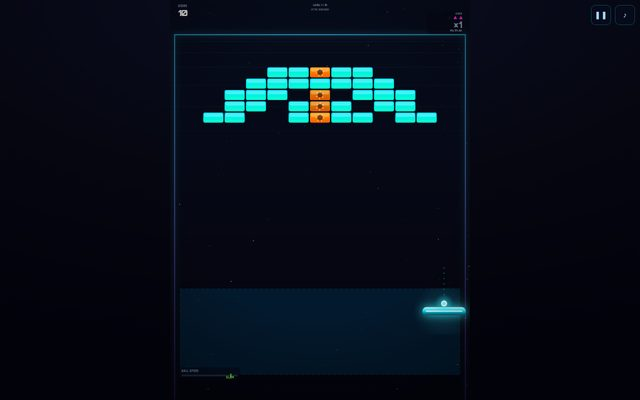
  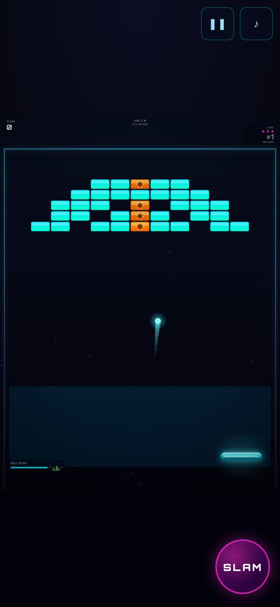
</p>

Desktop mid-play (score 20, level 1 of 10). On the phone, in play with a dedicated SLAM button for the swipe-slam gesture.

### openrouter-high — Neon Breakout Frenzy Edition

<p align="center">
  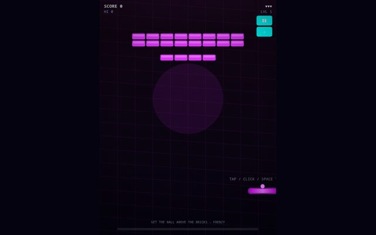
  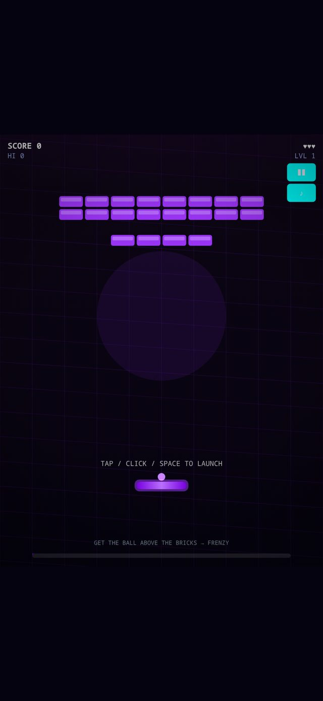
</p>

Desktop and phone both show the pre-launch state: the ball never launched under automation (tap, click and Space all failed), so its desktop score is 0. Whether launch is broken or the script missed the gesture is unresolved; see Methods and caveats.

### anthropic-high — TOPSIDE

<p align="center">
  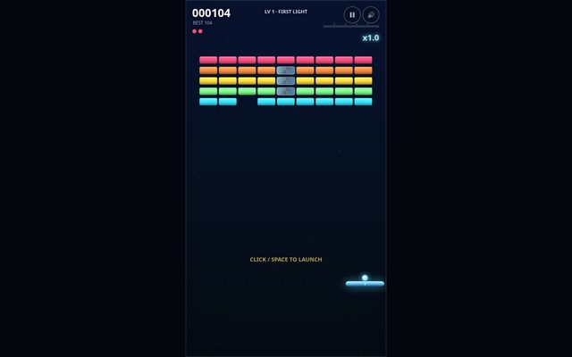
  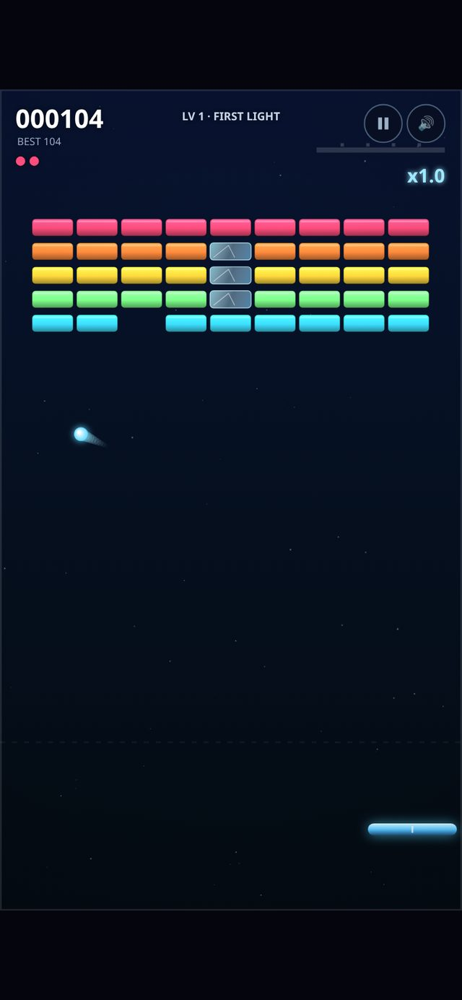
</p>

Desktop between balls at score 104, the automation's play score, with the launch prompt showing. On the phone, mid-play with the ball trailing.

### anthropic-med — ROOFTOP

<p align="center">
  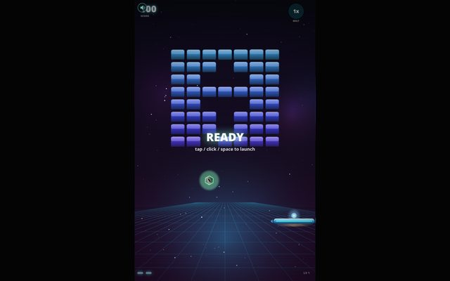
  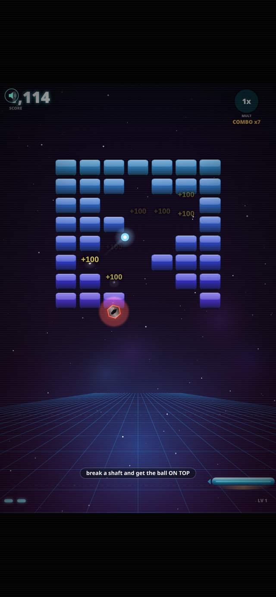
</p>

Desktop shows the READY overlay before the first launch. The phone shot is the most active frame the automation captured of any build: mid-play, combo x7, +100 score popups.

### openai-high — APOGEE

<p align="center">
  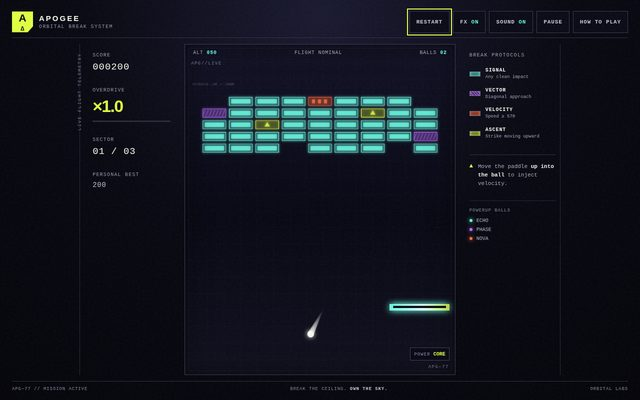
  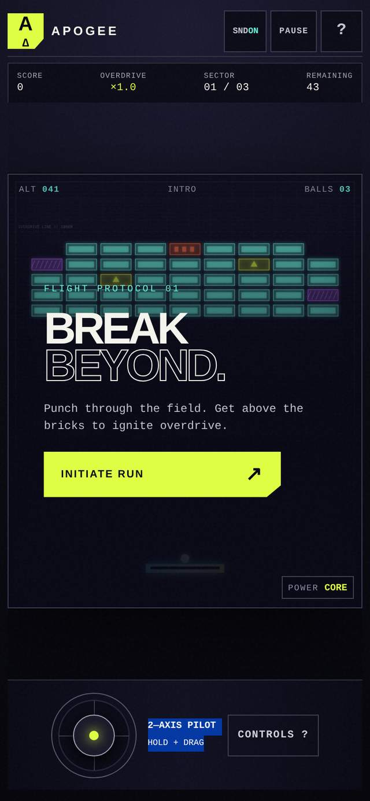
</p>

Desktop mid-play at score 200 with two balls, altitude and overdrive in the HUD. The phone shows the title screen with its 2-axis pilot thumbstick drawn.

### openai-low — NEON ASCENT

<p align="center">
  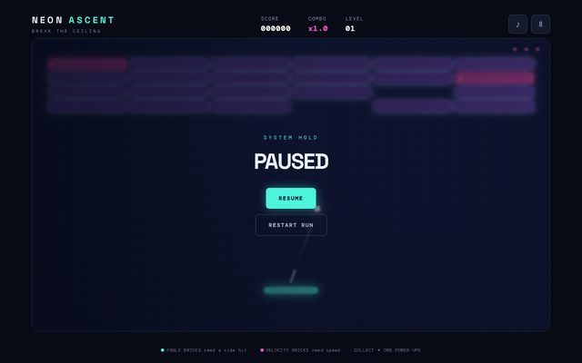
  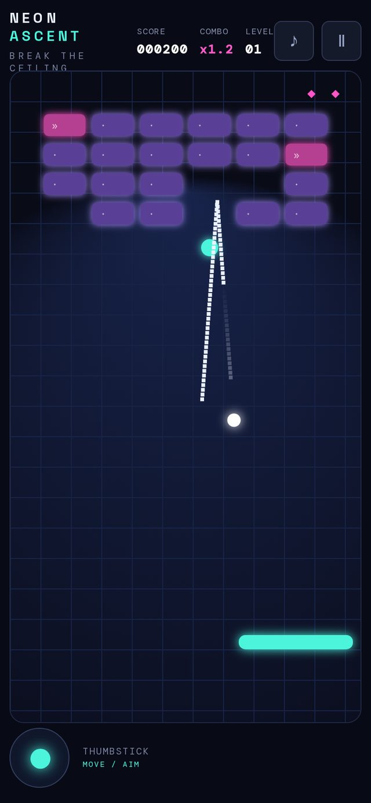
</p>

Desktop shows the pause screen: the script's own Space press paused the game mid-run. On the phone, mid-play at score 200 with the thumbstick widget visible.

## Cost versus quality

The cost spread across the six runs is 44 times, from `openai-low`'s $0.71 (5 minutes) to `openai-high`'s $31.59 (24 minutes). Quality on the rubric is nearly flat across most of that range: five of the six builds scored 26 or 27 of 27. The three builds under $2.50 all delivered working games, and `glm` landed 26 of 27 with a 13-file architecture, ten levels and a passing test harness for less than a tenth of `anthropic-med`'s bill. The $15-$32 builds are more polished — both Anthropic presets scored a perfect 27 — but not proportionally better. What the extra spend buys is the last point or two of polish and, for `anthropic-med`, a much longer wall-clock run.

Cost per actor, at list prices:

| Preset | Orchestrator | Task worker | Narrator | Total |
|---|---|---|---|---|
| `glm` | $2.10 | $0.06 | $0.03 | $2.19 |
| `openrouter-high` | $0.51 | $0.72 | $0.01 | $1.23 |
| `anthropic-high` | $3.59 | $11.69 | $0.26 | $15.54 |
| `anthropic-med` | $6.29 | $18.11 | $0.40 | $24.80 |
| `openai-high` | $23.01 | $8.47 | $0.11 | $31.59 |
| `openai-low` | $0.61 | $0.09 | $0.01 | $0.71 |

The narrator never costs anything worth counting. In three of six runs the worker cost more than the orchestrator, because the orchestrator delegates and verifies while the worker writes the code; `anthropic-med`'s worker made 733 calls and cost $18.11 of its $24.80.

Prompt-cache economics dominate these bills. The Anthropic presets ran at 93-95% cached input, `openrouter-high` at 88%, `glm` at 78%. `openai-high` sat at 6% because of a harness bug, not the provider: the per-call steering message was appended to the prompt on the fly and never recorded, so no prompt was ever an exact prefix of the next one, and OpenAI's cache only reuses exact prefixes. Commit `fb9bd9d` records steers as events so each prompt extends the last, and measured hit rates recovered to all but the new tail. The $31.59 in the table is what the run actually paid; a rerun on the fixed harness would pay materially less, so read it as the price of the bug rather than of the preset.

## Verdict

The measuring run ranked the builds as follows.

1. **`anthropic-high` — TOPSIDE (27/27).** The best overall. Every rubric item scored 3, it is one of only two builds with a real passing test suite, and touch was designed in: the phone build opens on a tap-to-start screen with drag-thumbstick instructions. It reached score 104 in scripted play, which was modest, and its profile is polished rather than flashy. 3,195 lines across 10 files in 1 h 11 min for $15.54 at a 93% cache ratio.
2. **`anthropic-med` — ROOFTOP (27/27).** Tied on the rubric and the most fun build observed in play: the highest score of the six (7,114 points) with combo x7 and +100 popups flying, and a tutorial hint that sells the core mechanic in one line. It is also the largest build (5,896 lines, 17 files), the slowest (3 h 6 min) and the second most expensive ($24.80), and it shipped no test suite. It ranks below TOPSIDE on tests and breadth at the same rubric total.
3. **`glm` — Neon Breakout Breach Edition (26/27).** The value result of the grid. For $2.19 in 38 minutes it produced 13 files and 3,335 lines: ten levels designed with breach paths into the attic, four special-brick mechanics, a 712-line adaptive music engine, and a passing headless Playwright harness that reported about 61 FPS. Its one miss is mobile: drag-anywhere rather than a literal thumbstick, the only non-3 on its board.
4. **`openai-high` — APOGEE (26/27).** The build that took the spec most seriously on screen: named break protocols (VECTOR, VELOCITY, ASCENT), named powerballs (ECHO, PHASE, NOVA), a 2-axis pilot thumbstick on mobile, and the richest HUD in the field. It completed 9 of 9 tasks in 24 minutes, the fastest of the premium presets, and its 9 unit tests pass. It was also the most expensive run at $31.59 with a 6% cache ratio, its e2e suite shipped but was never run, and its audio is the simplest of the large builds — one-shot tones, no continuous layers — which is the one non-3 that separates it from the 27s.
5. **`openrouter-high` — Neon Breakout Frenzy Edition (26/27).** The best code per dollar in the grid: a 1,071-line self-contained HTML file with no dependencies, a proper 1/120 fixed-timestep loop, three ball power-ups, angle- and speed-gated bricks, an endless mode, and an arp music loop that escalates with the frenzy level — $1.23 in 19 minutes. It ranks this low for two reasons outside the code: it is the only run with an error (the first task died on the image-input 404, leaving 1 of 2 tasks completed), and its ball never launched in automated play, which loses the tie-break whether or not that is an automation artifact. No test suite.
6. **`openai-low` — NEON ASCENT (18/27).** The cost floor of the exercise. $0.71 and 5 minutes bought about 34 physical lines of minified JavaScript that attempt all nine spec features, land a genuine first-class thumbstick on mobile (3 of 3, better than builds costing 30 times more), and scored 200 points in phone play. The floor shows through elsewhere: overdrive is a fixed y=42 ceiling check, the audio is a single beep() function, the timestep is variable, and there is no auto-pause.

## What the grid taught the harness

Profiling the six event logs found real waste, and the fixes are in this repository's history.

- **`fb9bd9d` — steers are recorded, so every prompt extends the last.** OpenAI's prompt cache only reuses a previous prompt that is an exact prefix of the new one. The harness appended its per-call instruction (the steer) to the prompt on the fly and never recorded it, so consecutive prompts were not prefixes of each other, and the Astra run cached only 6 percent of its input. Steers are now recorded as `steer` events, so each prompt extends the last; measured hit rates recovered to all but the new tail. Reasoning items are replayed by default, as OpenAI recommends.
- **`95b364a` — route fallback for every actor.** Only the orchestrator had a fallback route; task workers and the narrator used their primary route only, so an out-of-credits OpenAI key would fail every task. All three actors now fall back, and a billing failure is never retried.
- **`d08c0d4` — three curbs on wasted turns.** A re-read of an unchanged file returns a one-line note (`force: true` reads anyway). A second look at an unchanged screenshot does not resend the image. And an orchestrator that has edited files itself eight times in one context is told to delegate — the GLM-5.3 run made 33 direct edits against 6 delegations, while the Kimi K3 run delegated properly.
- **`4b8e277` — image rejections fall back to text.** Some OpenRouter models answer `view_image` with a 404, "no endpoints support image input". That response is now treated as an image rejection and the actor falls back to text. The Kimi K3 build lost its first task to it, which is the single error in the results table.

One open question, not a fix: the `anthropic-med` run had a playable game after about 15 minutes and spent the remaining 2 hours 50 minutes on polish passes, because the prompt said "relentlessly" and nothing in the harness signals diminishing returns. When to stop is still unanswered.

## Methods and caveats

- Play was scripted Chromium (Playwright), not a human: mouse sweeps on desktop, scripted touch drags on the phone, about 20 seconds per build per viewport.
- Sound was never heard; the play harness was headless. Audio scores come from the code.
- Rubric scores came from code reading plus that scripted play, not from a blind review.
- The Kimi build's ball never launched under automation (tap, click and Space all failed). That may be an automation artifact or a real input bug; its desktop screenshots show the pre-launch state.
- The `openai-low` desktop game was paused by the script's own Space press, so part of its desktop session is the pause screen.
- Costs are at September 2026 list prices and are heavily influenced by each provider's cache economics, so cross-provider comparisons are not apples to apples.
- `openai-low`'s source is minified (34 physical lines, about 10 KB of `game.js`); its line count is real code, just compressed, and not comparable with the others.
- Frame rate was not measured except where a build's own test suite reported it (`glm`'s harness reported about 61 FPS).
- Every number on this page is in [`docs/grid/results.json`](grid/results.json); the spec is [`docs/grid/SPEC.md`](grid/SPEC.md).

## How to reproduce

Put the spec in a fresh directory as `INSTRUCTIONS.md` and run the same prompt once per preset:

```
EAGENT_FINALECHAT=off eagent --preset NAME -p "Read INSTRUCTIONS.md and relentlessly build it until you're confident that it's fully and completely implemented to the highest possible standard you can manage."
```

`EAGENT_FINALECHAT=off` keeps the phone mirror out of the way for a grid of unattended runs. Six directories, six presets (`glm`, `openrouter-high`, `anthropic-high`, `anthropic-med`, `openai-high`, `openai-low`), run at the same time, reproduces the set. The measuring run was the same command shape on `openrouter-high` with the measurement brief in place of the game spec; that brief lives with the run directories outside this repository, and `docs/grid/results.json` is its compiled output.